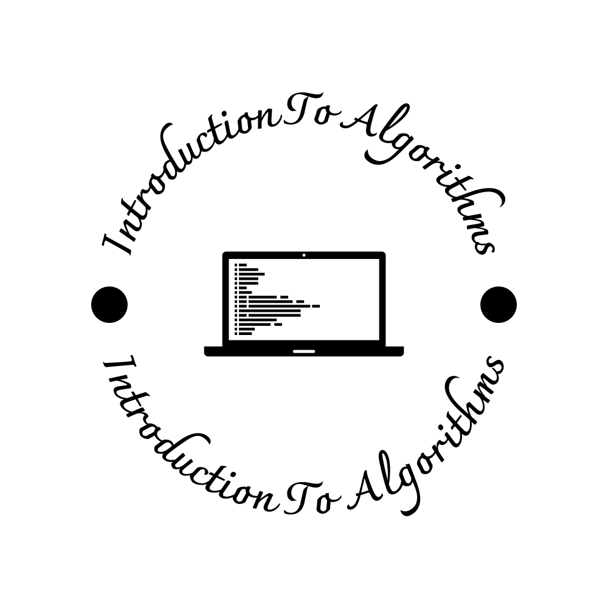

# Introduction to Algorithms

[](https://mdxjs.com/)
[](https://github.com/sikepuri-algorithm/sikepuri-algorithm.github.io/actions/workflows/deploy.yml)
[](https://github.com/sikepuri-algorithm/sikepuri-algorithm.github.io/actions/workflows/ci.yml)
[](https://github.com/sikepuri-algorithm/sikepuri-algorithm.github.io/releases)
[](LICENSE)


<div style="text-align: center">
    
</div>

これは、アルゴリズム入門のシケプリです。[こちら](https://sikepuri-algorithm.github.io/)から見ることができます。

[Docusaurus](https://docusaurus.io/) を使って作っています。

## 環境構築

Node.js がインストールされていることを前提とします。

次のコマンドで必要なパッケージをインストールできます。

```shell
npm ci
```

以下は、Formatter を実行させるためのスクリプトです。実行しなくて構いません。

```shell
# Poetry のインストール
curl -sSL https://install.python-poetry.org | python3 -

# Poetry のパッケージのインストール
poetry install

# フォーマットの実行
make format
```

## 開発

次を実行すると、ローカルサーバーが立ち上がり、プレビューが表示されます。

```shell
npm start
```

## コントリビューション

誤植などがありましたら、Issue や PR などで気軽に教えてください。
