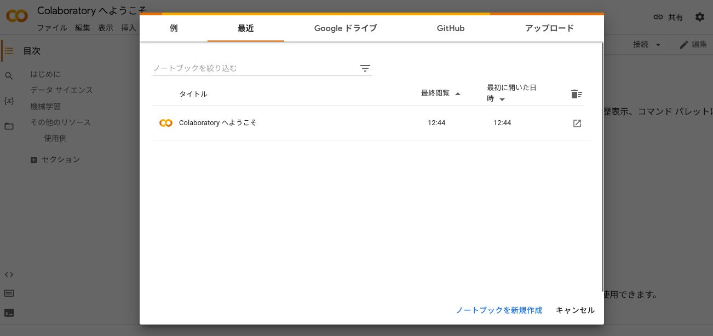

import helloWorldOnColab from "./hello-world-on-colab.mp4";

# 環境構築（Google Colaboratory）

昔はプログラミングの開発環境を整えることはとても大変な作業でしたが、今は Google の開発した Google Colaboratory を使うとブラウザ上で簡単に Python を実行することができます。

次の動画のようにすることでプログラムを簡単に実行できるので、一度やってみてください。

<video src={helloWorldOnColab} controls width="100%" />

1. Google アカウントを用意してログインしておいてください。

2. ログインした状態でウェブブラウザで [https://colab.research.google.com/](https://colab.research.google.com/) にアクセスします。すると、次のような画面が表示されます。

   

3. `ノートブックを新規作成` をクリックします。

   

4. 新しいファイルが開いたら、コードを書くことができます。セルの中に `print("Hello World!")` のように書いて、Windows や Linux では `Ctrl + Enter`、Mac では `Command + Enter` で任意の Python のコードを実行させることができます。

   

:::tip キーボード・ショートカット

`Ctrl + Enter` は、`Ctrl` キーと `Enter` キーを同時に押すということです。`Command + Enter` も同じで、`Command` キーと `Enter` キーを同時に押すということです。

これらは、キーボード・ショートカットと呼ばれ、使いこなすことで高速にパソコンを操作できるようになります。

:::
