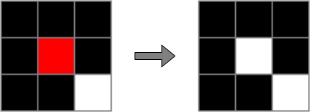
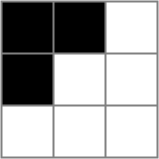

import ViewSource from "@site/src/components/ViewSource";
import Answer from "@site/src/components/Answer";
import LifeGame from "@site/src/components/LifeGame";
import PlayArrowIcon from "@mui/icons-material/PlayArrow";

# ライフゲーム

今回は、複雑なプログラムを実際に書いてみましょう。ライフゲームのプログラムを実際に書いていきます。

## ライフゲームとは

ライフゲームとは、1970 年に英国の数学者ジョン・ホートン・コンウェイが考案した生命の誕生と死を再現したシミュレーションゲームです。

過疎でも過密でも生命の生存に適さないということをシンプルなモデルで再現しています。

## ライフゲームのルール

- 碁盤の目上のセルの上に一体の生命がいるとする。

- 各セルには、「生」と「死」の二種類の状態がある。

- 生きているセルはで、死んでいるセルはで表す。

- 次の世代は、そのセルの周囲の 8 つのセルの現在の状態によって決定される。

- 次の世代は、次の 4 つのルールで決定される。

<dl>
  <dt>
    <strong>誕生</strong>
  </dt>
  <dd>死んでいるセルの周りに生きたセルが3つある時、誕生する。</dd>
</dl>


<dl>
  <dt>
    <strong>生存</strong>
  </dt>
  <dd>
    生きているセルの周りに生きたセルが2つか3つある時、生存することができる。
  </dd>
</dl>


<dl>
  <dt>
    <strong>過疎</strong>
  </dt>
  <dd>生きているセルの周りに生きたセルが1つ以下しかない時、死滅する。</dd>
</dl>


<dl>
  <dt>
    <strong>過密</strong>
  </dt>
  <dd>生きているセルの周りに生きたセルが4つ以上ある時、死滅する。</dd>
</dl>





## ライフゲームで遊んでみる

ライフゲームを簡単に遊べる Web アプリを作ってみました。下のマスをクリックまたはタッチすると、マスの色を反転することができます。これで少し遊ぶことでライフゲームの仕組みを理解してください。

<LifeGame />

## ライフゲームのプログラム

### 全体

早速、ライフゲームの Python でのプログラムを見てみましょう。この後、詳しく解説するので、分からなくても構いません。Python のプログラムの実行結果をブラウザ上で動かせるようにしてあるので、<PlayArrowIcon/>ボタンを押して実際に動く様子を確認してみてください。

<ViewSource path="/life-game/life_game.ipynb" />

それでは、実際にライフゲームのプログラムを作っていきましょう。

### 盤面の表し方

次のような盤面はプログラム上でどのように表すのが良いでしょうか？



これに関しては、次のように二次元配列を使うと良さそうです。さらに、生きているセルを 1、死んでいるセルを 0 とするとセルの値を足すだけで簡単に生きたセルの数を計算することができそうです。

```python
board = [[1, 1, 0],
         [1, 0, 0],
         [0, 0, 0]]
```

### 生きたセルをカウント

次に、ある盤面の $i$ 行 $j$ 列の周りに生きたセルが何個あるのかを求める関数を作りましょう。

関数の引数に `board`、`i`、`j` があるとしましょう。このとき、$i-1$ 行目から $i+1$ 行目でありかつ $j-1$ 列目から $j+1$ 列目であるセルの値の和から、$i$ 行 $j$ 列のセルの値（つまり自分の値）を引けばできそうです。次のようになると思えます。

<ViewSource path="/life-game/count_neighbors_draft.ipynb" />

しかし、実はこれではセルが端にある時にエラーが出てしまいます。そこで、セルが端にある時も考慮してプログラムを作ると、次のようになります。

<ViewSource path="/life-game/count_neighbors.ipynb" />

### あるセルの生死の判定

次に、次の世代においてあるセルが生きているかを確認する関数を作ってみましょう。先程、あるセルの周りに生きたセルが何個あるのかを求める関数を作ったので、それを使います。関数の引数は、先程のように `board`、`i`、`j` で良いでしょう。後は、ライフゲームの定義通りにプログラムを書いていけばよいでしょう。

<ViewSource path="/life-game/is_alive.ipynb" />

### 次の世代の計算

次に、次の世代の盤面を計算する関数を考えます。
引数は `board` として、次の世代の様子を格納する配列を作ってそこに結果を格納していきましょう。

配列の作り方はいろいろありますが、ここではリスト内包表記と呼ばれる方法で行いましょう。
例えば、`[0, 0, 0, 0, 0]` のような配列は次のようにして作ることができます。

```python
[0 for _ in range(5)]
```

つまり、`[0 for _ in range(n)]` は、`[0, 0, 0, ..., 0]` のようになります。

さらに、`[[0, 0, 0], [0, 0, 0], [0, 0, 0], [0, 0, 0]]` のような配列は次のようにして作ります。

```python
[[0 for _ in range(3)] for _ in range(4)]
```

:::note `ita` ライブラリの `make2d` 関数

大学が用意した `ita` ライブラリでも配列を作ることができます。

次のような構文で新たな一次元配列を作ることができます。

```python
ita.array.make1d(要素数)
```

さらに、新たな二次元配列を作ることもできます。

```python
ita.array.make2d(行数,列数)
```

:::

これらを使ってあげると、次のようなプログラムになるはずです。

<ViewSource path="/life-game/next_generation.ipynb" />

### すべての盤面の計算

次の世代の盤面を計算することができたので、次は指定した世代までの盤面を計算する関数を作りましょう。

引数を `board` と世代数 `n` にすると、次のようにプログラムを書けます。

<ViewSource path="/life-game/life_game_func.ipynb" />

### アニメーション

後はこれをアニメーションにしてあげれば、完成です。

サンプルデータは次のようにしましょう。これはグライダーと呼ばれるライフゲームにおいて有名なデータで、グライダーが移動していくように見えるものです。

```python
data = [
    [0, 0, 0, 0, 0, 0, 0, 0],
    [0, 0, 0, 0, 0, 0, 0, 0],
    [0, 0, 0, 0, 0, 0, 0, 0],
    [0, 0, 0, 0, 0, 0, 0, 0],
    [0, 0, 0, 0, 1, 1, 1, 0],
    [0, 0, 0, 0, 1, 0, 0, 0],
    [0, 0, 0, 0, 0, 1, 0, 0],
    [0, 0, 0, 0, 0, 0, 0, 0],
]
```

アニメーションを作るのは、`ita` ライブラリを使えば簡単です。三次元配列を次のように渡してあげれば、1 のところは黒で 0 のところは白にしてアニメーションをつくってくれます。

```python
ita.plot.animation_show(三次元配列)
```

今までのをすべて合わせると、次のようになって冒頭のプログラムができました。

<ViewSource path="/life-game/life_game.ipynb" />
