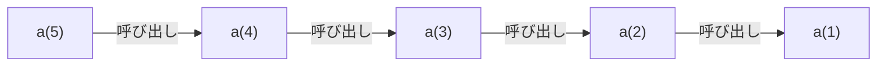
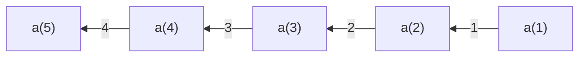
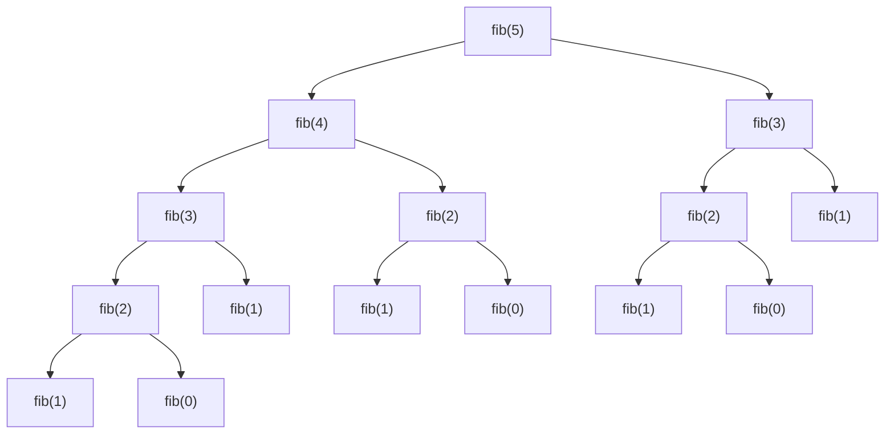

import ViewSource from "@site/src/components/ViewSource/ViewSource";
import Answer from "@site/src/components/Answer";

# 再帰

## 簡単な再帰関数

今回は、再帰関数を学んでいきます。

ではまずは、次の問題を考えてみましょう。

$a_1 = 1$、$a_n = a_{n - 1} + 1$ とします。このとき、$a_n$ を求めるプログラムを書いてください。

様々な方法が考えられます。

<h3>解法 1</h3>

この漸化式は、次のように数学的に解くことができます。

$$
\begin{align*}
    a_n            &= a_{n-1} + 1 \\
    \therefore a_n &= a_1 + (n-1)\times 1 \\
    \therefore a_n &= n
\end{align*}
$$

よって、この結果を使えば次のように簡単に解けます。

<ViewSource path="/recursion/recurrence_relation_analytical.ipynb" />

<h3>解法 2</h3>

他には、次のようにして $a_1,a_2,a_3,\cdots$ のように順番に求めていくこともできます。

<ViewSource path="/recursion/recurrence_relation_dp.ipynb" />

解法 1 のように数学的に解くことができればもちろん最も良いですが、数学的に解けないような場合は解法 2 のようにするしかなさそうです。しかし、解法 2 は漸化式の形とは少し見た目が違うため少し考えてから作らないといけません。

そのようなときに、再帰関数を使うとより簡単に書くことができます。（実は、再帰関数を使う以外の選択肢がないような場面もあります。）

実際に、この問題を再帰関数を使って解いたプログラムを見てみましょう。

<ViewSource path="/recursion/recurrence_relation_rec.ipynb" />

このプログラムを見ると、漸化式の形そのままですね。何も考えずに簡単に作ることができます。

さらに、このプログラムをよく見ると関数の中に関数が入っている形になっています。`a(n)` の値を求めるために `a(n - 1)` を使っています。さらに、`a(n - 1)` を求めるために `a(n - 2)` を使っています。これを繰り返していきますが、`a(1)` は `1` とわかっているので、そこで終了します。

再帰関数の作り方をまとめると、次のようになります。

1. 漸化式を立てて、自身を呼び出す。（例：$a_n = a_{n-1} + 1$ ）
1. 初期条件の処理を別に作っておく。（例：$a_1 = 1$ ）

:::info

再帰の定義を普通に書けば次のようになります。

> **再帰**（さいき　英:Recursion,Recursive）は、ある物事について記述する際に、記述しているもの自体への参照が、その記述中にあらわれることをいう。 フリー百科事典 Wikipedia より

しかし、再帰の性質から次のように定義が書かれることもあります（笑）

<iframe
  height="350px"
  src="https://m.ansaikuropedia.org/index.php?title=%E5%86%8D%E5%B8%B0&redirect=no"
/>

コンピューターの世界では、再帰を用いた命名もよくあります。再帰的接頭語と呼ばれます。例えば、PHP は「PHP: Hypertext Preprocessor」、GNU は「GNU's Not Unix」、WINE は「Wine Is Not an Emulator」、TikZ は「TikZ ist kein Zeichenprogramm」となっています。
:::

## 再帰関数を使ったフィボナッチ数列

では、再帰を使ってもう少し難しいプログラムも作ってみましょう。

フィボナッチ数を求めるプログラムを作ってみましょう。
フィボナッチ数列（$F_n$）は、次のように定義されます。

$$
\begin{align*}
    &F_0 = 0 \\
    &F_1 = 1 \\
    &F_n = F_{n - 1} + F_{n - 2} \quad (n\geq 2)
\end{align*}
$$

次のような数列になっています。

$$
0, 1, 1, 2, 3, 5, 8, 13, 21, 34, 55, 89, 144, 233, 377, 610, 987, 1597, \cdots
$$

<ViewSource path="/recursion/fib.ipynb" />

やはり、再帰を使うと定義どおりに書けて簡単ですね。

`fib` 関数の流れは次のようになっています。

:::info
実は、フィボナッチ数列の一般項は求めることができます。ビネの公式と呼ばれます。

$$
F_n = F_{n - 1} + F_{n - 2}
$$

$x^2 - x - 1 = 0$ の 2 解を $\alpha, \beta$ とする。すなわち、$\displaystyle \alpha = \frac{1 + \sqrt{5}}{2}$、$\displaystyle \beta = \frac{1 - \sqrt{5}}{2}$とすれば、

$$
\begin{dcases}
    \alpha + \beta &= 1 \\
    \alpha \beta   &= -1
\end{dcases}
$$

であるから、

$$
F_n - (\alpha + \beta)F_{n - 1} + \alpha \beta F_{n - 2} = 0
$$

$$
\therefore
\begin{dcases}
    F_n - \alpha F_{n - 1} &= \beta (F_{n - 1} - \alpha F_{n - 2}) \\
    F_n - \beta F_{n - 1}  &= \alpha (F_{n - 1} - \beta F_{n - 2})
\end{dcases}
$$

$$
\therefore
\begin{dcases}
    F_{n + 1} - \alpha F_n &= \beta^n (F_1 - \alpha F_0) \\
    F_{n + 1} - \beta F_n  &= \alpha^n (F_1 - \beta F_0)
\end{dcases}
$$

$$
\therefore (\alpha-\beta)F_n = (\alpha^n - \beta^n)F_1 - F_0 (\beta \alpha^n - \alpha \beta^n)
$$

$$
\therefore F_n = \frac{\alpha^n - \beta^n}{\alpha-\beta}
$$

$$
\therefore F_n = \frac{1}{\sqrt{5}}\left\{\left(\frac{1 + \sqrt{5}}{2}\right)^n - \left(\frac{1 - \sqrt{5}}{2}\right)^n\right\}
$$

:::

### 練習問題 1

再帰関数を使って、$1$ から $n$ までの和を求める関数を作ってみましょう。

<Answer>
漸化式は、次のようになります。

$$
\begin{align*}
    &a_1=1 \\
    &a_n=a_{n - 1} + n
\end{align*}
$$

これを基にすると、次のようになります。

<ViewSource path="/recursion/sum.ipynb" />

</Answer>

### 練習問題 2

再帰関数を使って、最大公約数を求める関数を作ってみましょう。

さらに、その結果を用いて、最小公倍数を求める関数も作ってみましょう。

<Answer>

ユークリッドの互除法を用いれば簡単にできます。

例：$30$ と $18$ の最大公約数を求める。

- $30$ を $18$ で割った余りは、$12$
- $18$ を $12$ で割った余りは、$6$
- $12$ を $6$ で割った余りは、$0$

よって、最大公約数は $6$

これを使うと、最大公約数を求めるプログラムは次のようになります。

<ViewSource path="/recursion/gcd.ipynb" />

また、最大公約数 $\mathrm{gcd}(a, b)$ と最小公倍数 $\mathrm{lcm}(a, b)$ の間には次のような関係があります。

$$
\mathrm{gcd}(a, b)\cdot \mathrm{lcm}(a, b) = ab
$$

これを使うと、最小公倍数を求めるプログラムは次のようになります。

<ViewSource path="/recursion/lcm.ipynb" />

</Answer>

### 練習問題 3

リュカ数を求めるプログラムを作ってみましょう。

リュカ数列（ $L_n$ ）は次のように定義されます。

$$
\begin{align*}
    &L_0 = 2 \\
    &L_1 = 1 \\
    &L_n = L_{n - 1} + L_{n - 2} \quad (n\geq 2)
\end{align*}
$$

リュカ数列は次のようになります。

$$
2, 1, 3, 4, 7, 11, 18, 29, 47, 76, 123, 199, 322, 521, 843, 1364, 2207, \cdots
$$

<Answer>

フィボナッチ数列のプログラムから、`n == 0` の時と `n == 1` の時の値を変えるだけで簡単に作れます。

<ViewSource path="/recursion/lucas.ipynb" />

:::info
リュカ数列の一般項は、フィボナッチ数列の時のように計算すると、次のようになります。

$$
\begin{align*}
    (\alpha-\beta)L_n            &= (\alpha^n - \beta^n)L_1 - L_0 (\beta \alpha^n - \alpha \beta^n) \\
    \therefore (\alpha-\beta)L_n &= (1 - 2\beta)\alpha^n - (2\alpha - 1)\beta^n \\
    \therefore L_n &= \sqrt{5} \cdot \frac{\alpha^n + \beta^n}{\alpha-\beta}
\end{align*}
$$

$$
L_n = \left(\frac{1 + \sqrt{5}}{2}\right)^n + \left(\frac{1 - \sqrt{5}}{2}\right)^n
$$

:::

</Answer>

### 練習問題 4

トリボナッチ数を求めるプログラムを作ってみましょう。
トリボナッチ数列（ $T_n$ ）は次のように定義されます。

$$
\begin{align*}
    &T_0 = 0 \\
    &T_1 = 0 \\
    &T_2 = 1 \\
    &T_n = T_{n - 1} + T_{n - 2} + T_{n - 3} \quad (n\geq 3)
\end{align*}
$$

トリボナッチ数列は次のようになります。

$$
0, 0, 1, 1, 2, 4, 7, 13, 24, 44, 81, 149, 274, 504, \cdots
$$

:::info
ちなみに、テトラナッチ数、ペンタナッチ数、…もあります。

| $k$ | 名称             |
| --- | ---------------- |
| 2   | フィボナッチ数   |
| 3   | トリボナッチ数   |
| 4   | テトラナッチ数   |
| 5   | ペンタナッチ数   |
| 6   | ヘキサナッチ数   |
| 7   | ヘプタナッチ数   |
| 8   | オクタナッチ数   |
| 9   | ノナナッチ数     |
| 10  | デカナッチ数     |
| 11  | ウンデカナッチ数 |
| 12  | ドデカナッチ数   |

:::

:::info
トリボナッチ数列の一般項は、次のようにして計算できます。

$x^3 - x^2 - x - 1 = 0$ の 3 解を $\alpha, \beta, \gamma$ とすると、

$$
\begin{dcases}
    \alpha + \beta + \gamma = 1 \\
    \alpha \beta + \beta \gamma + \gamma \alpha = -1 \\
    \alpha \beta \gamma = 1
\end{dcases}
$$

$$
T_n = T_{n - 1} + T_{n - 2} + T_{n - 3}
$$

$$
\therefore T_n - (\alpha + \beta + \gamma)T_{n - 1} + (\alpha \beta + \beta \gamma + \gamma \alpha)T_{n - 2} - \alpha \beta \gamma T_{n - 3} = 0
$$

$$
\begin{dcases}
    \therefore T_n - \alpha T_{n - 1} = \beta (T_{n - 1} - \alpha T_{n - 2}) + \gamma (T_{n - 1} - \alpha T_{n - 2}) - \beta \gamma(T_{n - 2} - \alpha T_{n - 3}) \\
    \therefore T_n - \beta T_{n - 1} = \gamma (T_{n - 1} - \beta T_{n - 2}) + \alpha (T_{n - 1} - \beta T_{n - 2}) - \gamma \alpha(T_{n - 2} - \beta T_{n - 3})
\end{dcases}
$$

$U_n = T_{n + 1} - \alpha T_n, V_n = T_{n + 1} - \beta T_n$ とする。

$$
\begin{dcases}
    U_n = \beta U_{n - 1} + \gamma U_{n - 1} - \beta \gamma U_{n - 2} \\
    V_n = \gamma V_{n - 1} + \alpha V_{n - 1} - \gamma \alpha V_{n - 2}
\end{dcases}
$$

$$
\therefore
\begin{dcases}
    U_n - \beta U_{n - 1} = \gamma (U_{n - 1} - \beta U_{n - 2}) \\
    U_n - \gamma U_{n - 1} = \beta (U_{n - 1} - \gamma U_{n - 2})
\end{dcases}
\begin{dcases}
    V_n - \gamma V_{n - 1} = \alpha (V_{n - 1} - \gamma V_{n - 2}) \\
    V_n - \alpha V_{n - 1} = \gamma (V_{n - 1} - \alpha V_{n - 2})
\end{dcases}
$$

$U_0 = 0, U_1 = 1, V_0 = 0, V_1 = 1$ から、

$$
\therefore
\begin{dcases}
    U_n = \frac{\beta^n - \gamma^n}{\beta - \gamma} \\
    V_n = \frac{\gamma^n - \alpha^n}{\gamma - \alpha}
\end{dcases}
$$

$$
\therefore
\begin{dcases}
    T_{n + 1} - \alpha T_n = \frac{\beta^n - \gamma^n}{\beta - \gamma} \\
    T_{n + 1} - \beta T_n = \frac{\gamma^n - \alpha^n}{\gamma - \alpha}
\end{dcases}
$$

$$
\therefore T_n = \frac{\gamma^n - \alpha^n}{(\alpha - \beta)(\gamma - \alpha)} - \frac{\beta^n - \gamma^n}{(\alpha - \beta)(\beta - \gamma)}
$$

$$
\therefore T_n = \frac{\alpha^n}{(\alpha - \beta)(\alpha - \gamma)} + \frac{\beta^n}{(\beta - \gamma)(\beta - \alpha)} + \frac{\gamma^n}{(\gamma - \alpha)(\gamma - \beta)}
$$

テトラナッチ数は、次のようになるようです。確かめてはいません。

$x^4 - x^3 - x^2 - x - 1 = 0$ の 4 解を $\alpha, \beta, \gamma, \delta$ とすると、

$$
\begin{split}
T_n = \frac{\alpha^n}{(\alpha - \beta)(\alpha - \gamma)(\alpha - \delta)} + \frac{\beta^n}{(\beta - \gamma)(\beta - \delta)(\beta - \alpha)} \\
    + \frac{\gamma^n}{(\gamma - \delta)(\gamma - \alpha)(\gamma - \beta)} + \frac{\delta^n}{(\delta - \alpha)(\delta - \beta)(\delta - \gamma)}
\end{split}
$$

:::

<Answer>
  <ViewSource path="/recursion/tri.ipynb" />
</Answer>
