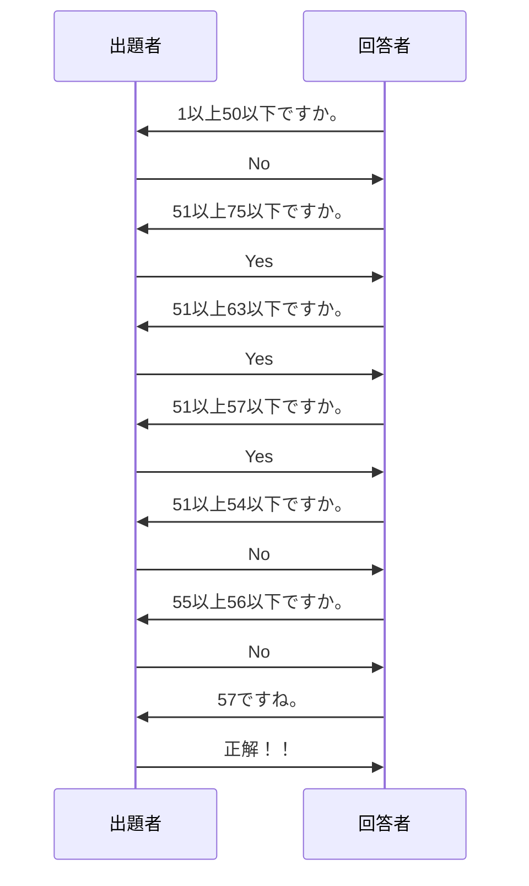

import ViewSource from "@site/src/components/ViewSource/ViewSource";
import Answer from "@site/src/components/Answer";

# 探索

今回は、大規模データの探索方法について見ていきます。

## 探索とは

次のような名簿があったとします。この中から、ある人の出席番号を探すことを考えてみましょう。これが、探索です。探索アルゴリズムには、線型探索アルゴリズムや二分探索アルゴリズムなどがあります。ここでは、それぞれの探索アルゴリズムについてみていきましょう。

| 出席番号 | 名前   |
| -------- | ------ |
| 1        | 伊藤   |
| 2        | 井上   |
| 3        | 加藤   |
| 4        | 木村   |
| 5        | 小林   |
| 6        | 斎藤   |
| 7        | 佐々木 |
| 8        | 佐藤   |
| 9        | 清水   |
| 10       | 鈴木   |
| 11       | 高橋   |
| 12       | 田中   |
| 13       | 中村   |
| 14       | 林     |
| 15       | 松本   |
| 16       | 山田   |
| 17       | 山口   |
| 18       | 山本   |
| 19       | 吉田   |
| 20       | 渡辺   |

## 線形探索

次のように、データが与えられたとします。

```python
students = [
    "伊藤",
    "井上",
    "加藤",
    "木村",
    "小林",
    "斎藤",
    "佐々木",
    "佐藤",
    "清水",
    "鈴木",
    "高橋",
    "田中",
    "中村",
    "林",
    "松本",
    "山田",
    "山口",
    "山本",
    "吉田",
    "渡辺",
]
```

ここから、佐藤さんの出席番号を計算することを考えてみましょう。

次のようにして、簡単に計算することができますね。

<ViewSource path="/search-algorithm/linear_search.ipynb" />

このプログラムは、配列の先頭から順に目的の値と一致するかを調べていくようになっています。このようなデータの探索アルゴリズムは、線型探索と呼ばれます。
このプログラムの時間計算量は、$O(n)$ です。

### 練習問題

降べきの順に整列された数列の中から、N 以上である最小の数字のインデックスを見つける関数を作ってみてください。

例えば、数列が `[1, 2, 3, 4, 5, 5, 7, 8, 10]` で $N = 5$ ならば、4 となります。

<Answer>
  <ViewSource path="/search-algorithm/linear_practice.ipynb" />
</Answer>

## 二分探索

### 二分探索とは

さきほどのようにデータが少ない場合は線型探索で書いても十分ですが、もっとデータ数が増えてしまったらどうでしょう。
例えば、ユーザー数が何億にもなるようなサービスでユーザー名を探すことになると、ユーザー名を探す度に何億もの計算を行わなけれず、これでは間に合いません。
そこで、線型探索アルゴリズム以外のアルゴリズムを考えなければなりません。

ここで、普段人間がどのようにしてデータを探しているかを考えてみましょう。

名簿から人の名前を探すのに、一番はじめから順に目的の名前と一致しているかを確認する人はほとんどいないと思います。
大抵の場合は、名簿をみて目的の名前よりも後ろの名前だったらその前を探し、目的の名前よりも前の名前だったらその後ろを探すといったことをしていると思います。

これを使ったアルゴリズムを考えれば、効率的に計算できそうです。

二分探索は、このようにすることで計算量を大幅に減らすことのできるアルゴリズムです。

中央の値を見て中央の値が目的の値よりも大きかったら、その値よりも小さい領域を探し、目的の値よりも小さかったら、その値よりも大きい領域を探すといったようにします。


この方法は整列されている場合にしか使えませんが、時間計算量は $O(\log_2 n)$ となり線型探索よりも非常に速く解を求めることができます。

| データサイズ | $n$         | $\log n$ |
| ------------ | ----------- | -------- |
| 10           | 10          | 4        |
| 100          | 100         | 7        |
| 1000         | 1000        | 10       |
| 10000        | 10000       | 14       |
| 100000       | 100000      | 17       |
| 1000000      | 1000000     | 20       |
| 1000000      | 10000000    | 24       |
| 10000000     | 100000000   | 27       |
| 100000000    | 100000000   | 30       |
| 1000000000   | 1000000000  | 34       |
| 10000000000  | 10000000000 | 37       |

表にしてみると、$O(\log n)$ の偉大さがよくわかりますね。データが 100 億個あっても、二分探索ならたった 37 回で求められます。これなら、どんなにユーザー数が増えても、問題ありません。

:::info
二分探索は、数当てゲームやイエス・ノーゲームで使われることもあります。

たとえば、1 から 100 の中から数字を当てるゲームで、お題が「57」だとしましょう。
次のようにすれば、$\lceil \log_2 100\rceil = 7$ 回で必ず答えがわかります。



:::

### アルゴリズム

では、二分探索を使ったプログラムを考えてみましょう。

プログラムの流れとしては、次のようになります。

1. `start` に下限値を `end` に上限値を入れる。
1. `center` を `(start + end) // 2` とする。
1. `center` の値よりも求める値が大きかったら、`start` を `center` で置き換える。逆の場合、`end` を `center` で置き換える。
1. 2,3 を繰り返すと、`start` と `end` が近づいていき `end` の値が求める値になるので、`end` の値を出力する。


### 実装

今までの内容を基に二分探索を使ったプログラムを作ってみましょう。

次のようになります。

<ViewSource path="/search-algorithm/binary_search.ipynb" />

### 二分探索のライブラリ

実は、二分探索を行うには [`bisect`](https://docs.python.org/ja/3/library/bisect.html) というライブラリがあります。

`bisect_left` 関数は、ある数を配列に挿入しようとした時、すでに配列に同じ数がある場合それらの数の中で最**小**の要素の左側に挿入した時のインデックスを返します。つまり、次のようになります。

<ViewSource path="/search-algorithm/bisect_left.ipynb" />

`bisect_right` 関数は、ある数を配列に挿入しようとした時、すでに配列に同じ数がある場合それらの数の中で最**大**の要素の左側に挿入した時のインデックスを返します。つまり、次のようになります。

<ViewSource path="/search-algorithm/bisect_right.ipynb" />

:::info
二分探索のアイディアは非常に簡単ですが、正確に実装することはとても難しいことで知られています。

次の論文によれば、書籍 20 冊のうち 15 冊が間違えていたようです。

実際に使うときは、ライブラリを使った方が良いかもしれません。

<cite>
  Richard E. Pattis. Textbook errors in binary searching. SIGCSE Bull.,
  20(1):190–194, feb 1988.
</cite>

:::

### 練習問題 1

降べきの順に整列された数列の中から、N 以上である最小の数字のインデックスを見つける関数を作ってみてください。

例えば、数列が `[1, 2, 3, 4, 5, 5, 7, 8, 10]` で $N = 5$ ならば、4 となります。

<Answer>
  <ViewSource path="/search-algorithm/binary_left_practice.ipynb" />
</Answer>

### 練習問題 2

降べきの順に整列された数列の中から、N 以下である最大の数字のインデックスを見つける関数を作ってみてください。

例えば、数列が `[1, 2, 3, 4, 5, 5, 7, 8, 10]` で $N = 5$ ならば、5 となります。

<Answer>
  <ViewSource path="/search-algorithm/binary_right_practice.ipynb" />
</Answer>
