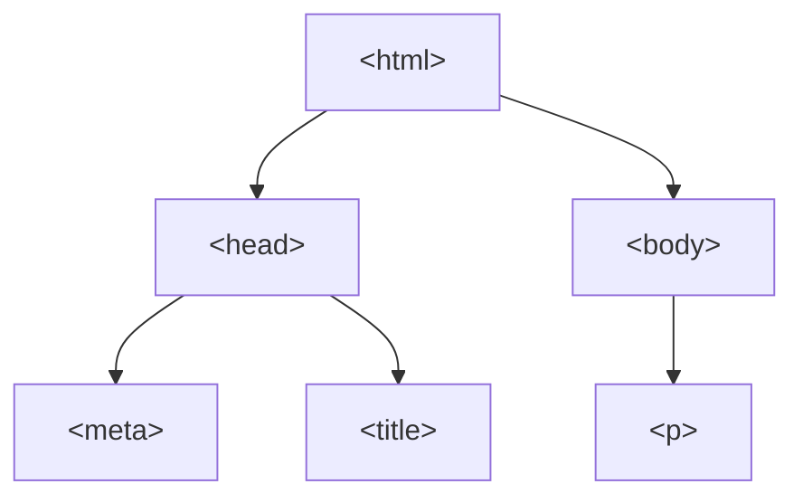

import InteractiveCodeEditor from "@site/src/components/InteractiveCodeEditor/InteractiveCodeEditor";

# HTML

## HTML とは

通常の Web サイトは、HTML を用いて作るのが一般的です。HTML(HyperText Markup Language) は、ウェブページを作成するために作られた言語で、様々なコンテンツを表現することができます。

## はじめての HTML

以下が HTML を用いた Hello World の例です。

```html title=index.html
<!DOCTYPE html>
<html lang="ja">
  <head>
    <meta charset="UTF-8" />
    <meta name="viewport" content="width=device-width, initial-scale=1.0" />
    <title>Document</title>
  </head>
  <body>
    <p>Hello World!</p>
  </body>
</html>
```

自分のパソコン上に `index.html` という名前のファイルを作って上のコードを保存してください。そうしたら、そのファイルをブラウザで開いてください。画面上に `Hello World!` と表示されるはずです。もしくは、このサイトでは HTML をブラウザ上で実行できるようにしているので、以下のコードを編集することで実行される内容をリアルタイムで見ることもできます。

<InteractiveCodeEditor
  language="html"
  defaultValue={`\
<!DOCTYPE html>
<html lang="ja">
  <head>
    <meta charset="UTF-8" />
    <meta name="viewport" content="width=device-width, initial-scale=1.0" />
    <title>Document</title>
  </head>
  <body>
    <p>Hello World!</p>
  </body>
</html>\
`}
/>

`Hello World!` と表示されましたか。

様々なことが書いてあり非常にわかりにくいですが、重要なのは `<body>` と `</body>` の間に挟まれた部分です。HTML は、タグと呼ばれるもので内容を囲うことで要素を作ります。今回の場合は、`<p>` と `</p>` で囲まれたところが段落になっています。つまり、`<` と `>` で囲まれる開始タグと `</` と `>` で囲まれる終了タグで内容を挟むことで要素を作ることができます。終了タグのはじめには、`/` があることに注意してください。

HTML は、タグを用いてどのように構造を表すのかさえわかっていれば、後は様々なタグを覚えるだけで簡単に扱えます。

:::info その他の要素

`<body>` 要素の中身だけがわかっていれば十分ですが、それ以外のコードについても簡単に解説しておきます。

先程のコードは次のようになっていました。

```html title=index.html
<!DOCTYPE html>
<html lang="ja">
  <head>
    <meta charset="UTF-8" />
    <meta name="viewport" content="width=device-width, initial-scale=1.0" />
    <title>Document</title>
  </head>
  <body>
    <p>Hello World!</p>
  </body>
</html>
```

はじめの行の `<!DOCTYPE html>` は、ファイルの先頭に書くことでここから HTML を書くということを明示的に宣言するものです。

`<html lang="ja">` と `</html>` で囲まれたところが、HTML の内容になっています。その中で、`<head>` と `</head>` で囲まれたところがヘッダーで、`<body>` と `</body>` で囲まれたところは、実際にブラウザ上に表示される内容になっています。

`<meta charset="UTF-8" />` は、文字コードに UTF-8 を使うという意味です。`<meta name="viewport" content="width=device-width, initial-scale=1.0" />` は、パソコンやスマートフォンそれぞれに合わせた表示をするために、必要になるものです。`<title>Document</title>` はタイトルを定義するもので、ここに書かれた内容はブラウザのタイトルバーに表示されます。

色々と説明しましたが、これらの内容はわかっていなくても構いません。とりあえず、コピペして、使ってください。



:::

## 様々なタグ

それでは、他のタグも見てみましょう。後は、タグを覚えて使うだけです。そして、HTML には、非常に豊富なタグが用意されているので、タグを使うことで大抵のことはできます。

### 段落

段落は、`<p>` を用いて表すことができます。`body` タグの中に以下のように書くことで、段落を作ることができます。

```html title=index.html
<p>
  あのイーハトーヴォのすきとおった風、夏でも底に冷たさをもつ青いそら、うつくしい森で飾られたモリーオ市、郊外のぎらぎらひかる草の波。
</p>
```

<InteractiveCodeEditor
  language="html"
  defaultValue={`\
<!DOCTYPE html>
<html lang="ja">
  <head>
    <meta charset="UTF-8" />
    <meta name="viewport" content="width=device-width, initial-scale=1.0" />
    <title>Document</title>
  </head>
  <body>
    <p>
      あのイーハトーヴォのすきとおった風、夏でも底に冷たさをもつ青いそら、うつくしい森で飾られたモリーオ市、郊外のぎらぎらひかる草の波。
    </p>
  </body>
</html>\
`}
/>

### 見出し要素

`<h1>` タグは、見出しを表します。

```html title=index.html
<h1>見出し</h1>
```

<InteractiveCodeEditor
  language="html"
  defaultValue={`\
<!DOCTYPE html>
<html lang="ja">
  <head>
    <meta charset="UTF-8" />
    <meta name="viewport" content="width=device-width, initial-scale=1.0" />
    <title>Document</title>
  </head>
  <body>
    <h1>見出し</h1>
  </body>
</html>\
`}
/>

`<h2>` タグは、`<h1>` タグの一つ下の見出しを表します。同じように `<h3>` タグ、`<h4>` タグ、`<h5>` タグ、`<h6>` タグがあります。

<InteractiveCodeEditor
  language="html"
  defaultValue={`\
<!DOCTYPE html>
<html lang="ja">
  <head>
    <meta charset="UTF-8" />
    <meta name="viewport" content="width=device-width, initial-scale=1.0" />
    <title>Document</title>
  </head>
  <body>
    <h1>見出し 1</h1>
    <h2>見出し 2</h2>
    <h3>見出し 3</h3>
    <h4>見出し 4</h4>
    <h5>見出し 5</h5>
    <h6>見出し 6</h6>
  </body>
</html>\
`}
/>

### 改行

HTML では、普通に改行しただけでは改行が出力されないようになっています。その代わりに、`<br>` タグを作って改行を出力します。

<InteractiveCodeEditor
  language="html"
  defaultValue={`\
<!DOCTYPE html>
<html lang="ja">
  <head>
    <meta charset="UTF-8" />
    <meta name="viewport" content="width=device-width, initial-scale=1.0" />
    <title>Document</title>
  </head>
  <body>
    Hello World!
    <br>
    Hello World!
  </body>
</html>\
`}
/>

### 強調

強調は、次のようにします。

```html title=index.html
<em>強調</em>
```

<InteractiveCodeEditor
  language="html"
  defaultValue={`\
<!DOCTYPE html>
<html lang="ja">
  <head>
    <meta charset="UTF-8" />
    <meta name="viewport" content="width=device-width, initial-scale=1.0" />
    <title>Document</title>
  </head>
  <body>
    <em>強調</em>
  </body>
</html>\
`}
/>

:::note
イタリック体になっていて違和感を覚えるかもしれませんが、HTML では論理的な構造のみを表して見た目は CSS という別の言語で表現するのが一般的です。CSS については、後で触れます。HTML で、見た目は表さないということは覚えておいてください。見た目を変えるためだけに、別のタグを使うことなどはしないでください。
:::

### 強い強調

さらに強い強調は、次のようにします。

```html title=index.html
<strong>さらに強い強調</strong>
```

<InteractiveCodeEditor
  language="html"
  defaultValue={`\
<!DOCTYPE html>
<html lang="ja">
  <head>
    <meta charset="UTF-8" />
    <meta name="viewport" content="width=device-width, initial-scale=1.0" />
    <title>Document</title>
  </head>
  <body>
    <strong>さらに強い強調</strong>
  </body>
</html>\
`}
/>

### 番号なし箇条書き

次のように書けば、箇条書きができます。

```html title=index.html
<ul>
  <li>アイテム1</li>
  <li>アイテム2</li>
  <li>アイテム3</li>
</ul>
```

<InteractiveCodeEditor
  language="html"
  defaultValue={`\
<!DOCTYPE html>
<html lang="ja">
  <head>
    <meta charset="UTF-8" />
    <meta name="viewport" content="width=device-width, initial-scale=1.0" />
    <title>Document</title>
  </head>
  <body>
    <ul>
      <li>アイテム1</li>
      <li>アイテム2</li>
      <li>アイテム3</li>
    </ul>
  </body>
</html>\
`}
/>

さらに、次のように入れ子にすることもできます。

```html title=index.html
<ul>
  <li>アイテム1</li>
  <li>
    アイテム2
    <ul>
      <li>サブアイテム1</li>
      <li>サブアイテム2</li>
    </ul>
  </li>
</ul>
```

<InteractiveCodeEditor
  language="html"
  defaultValue={`\
<!DOCTYPE html>
<html lang="ja">
  <head>
    <meta charset="UTF-8" />
    <meta name="viewport" content="width=device-width, initial-scale=1.0" />
    <title>Document</title>
  </head>
  <body>
    <ul>
      <li>アイテム1</li>
      <li>
        アイテム2
        <ul>
          <li>サブアイテム1</li>
          <li>サブアイテム2</li>
        </ul>
      </li>
    </ul>
  </body>
</html>\
`}
/>

### 番号付き箇条書き

番号付きの箇条書きもできます。次のように書けば、番号付きの箇条書きができます。

```html title=index.html
<ol>
  <li>アイテム1</li>
  <li>アイテム2</li>
  <li>アイテム3</li>
</ol>
```

<InteractiveCodeEditor
  language="html"
  defaultValue={`\
<!DOCTYPE html>
<html lang="ja">
  <head>
    <meta charset="UTF-8" />
    <meta name="viewport" content="width=device-width, initial-scale=1.0" />
    <title>Document</title>
  </head>
  <body>
    <ol>
      <li>アイテム1</li>
      <li>アイテム2</li>
      <li>アイテム3</li>
    </ol>
  </body>
</html>\
`}
/>

### 表

表も書くことができます。`<tr>` タグで行を表し、`<td>` タグで列を表します。

```html title=index.html
<table>
  <tr>
    <td>1</td>
    <td>2</td>
  </tr>
  <tr>
    <td>3</td>
    <td>4</td>
  </tr>
</table>
```

<InteractiveCodeEditor
  language="html"
  defaultValue={`\
<!DOCTYPE html>
<html lang="ja">
  <head>
    <meta charset="UTF-8" />
    <meta name="viewport" content="width=device-width, initial-scale=1.0" />
    <title>Document</title>
  </head>
  <body>
    <table>
      <tr>
        <td>1</td>
        <td>2</td>
      </tr>
      <tr>
        <td>3</td>
        <td>4</td>
      </tr>
    </table>
  </body>
</html>\
`}
/>

:::note
罫線などが表示されませんが、ちゃんと表は作れています。先程も触れたように、HTML では論理的な構造のみを表して見た目は CSS という別の言語で表現します。
:::

### リンク

リンクは次のように作れます。開始タグと終了タグの間に表示する文字を書いて、`href` 属性の中にリンク先の URL を記載します。`<a>` タグは、リンクを表すタグです。

:::tip 属性
属性は、要素の特徴を表すものです。

今回の `<a>` タグでは、`<a>` で囲まれた部分の文字に対して、`href` 属性で指定した URL などの情報が付加されます。
:::

```html title=index.html
<a href="https://sikepuri-algorithm.github.io/">Introduction to Algorithms</a>
```

<InteractiveCodeEditor
  language="html"
  defaultValue={`\
<!DOCTYPE html>
<html lang="ja">
  <head>
    <meta charset="UTF-8" />
    <meta name="viewport" content="width=device-width, initial-scale=1.0" />
    <title>Document</title>
  </head>
  <body>
    <a href="https://sikepuri-algorithm.github.io/">Introduction to Algorithms</a>
  </body>
</html>\
`}
/>

### 画像

画像は、次のようにして表示することができます。src 属性に、画像のパスを書き、alt 属性にその画像の代わりとなるテキスト情報を書きます。

```html title=index.html

```

<InteractiveCodeEditor
  language="html"
  defaultValue={`\
<!DOCTYPE html>
<html lang="ja">
  <head>
    <meta charset="UTF-8" />
    <meta name="viewport" content="width=device-width, initial-scale=1.0" />
    <title>Document</title>
  </head>
  <body>
    
  </body>
</html>\
`}
/>

他にも様々な記法があるので、自分で調べてみてください。HTML に関する情報は非常に豊富にあるので、すぐに見つかるはずです。

しかし、インターネット上には間違った情報や古い情報が非常に多いので、目的に合ったタグを見つけたら、詳細については[MDN](https://developer.mozilla.org/ja/)という Web サイトで確認することをおすすめします。このサイトには、すべてのタグの定義が詳細に書いてあります。
