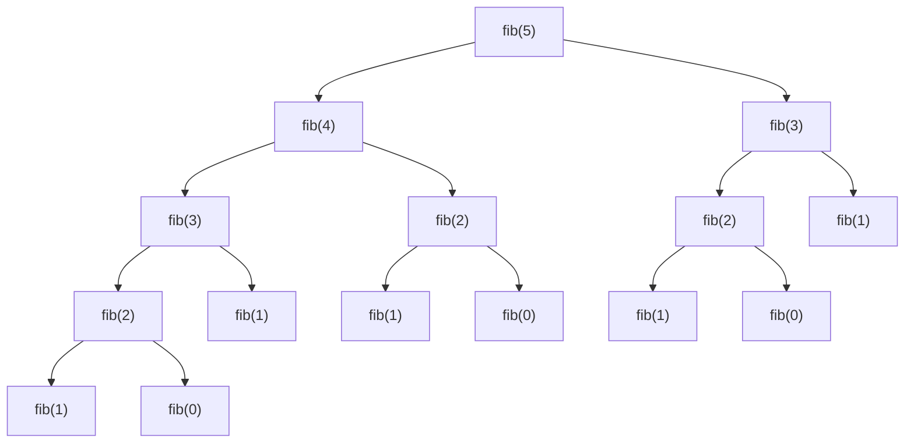

import ViewSource from "@site/src/components/ViewSource";
import Answer from "@site/src/components/Answer";

# 動的計画法

最後に、経路探索や自然言語処理などにも使われる動的計画法について学習します。

## フィボナッチ数列

動的計画法の説明に必ずといってもいいほどよく使われるフィボナッチ数列を例に説明していきます。

フィボナッチ数列 $F_n$ ( $0, 1, 1, 2, 3, 5, 8, 13, 21, 34 \cdots$ )は、次のように定義されるのでした。

$$
\begin{align*}
    &F_0 = 0 \\
    &F_1 = 1 \\
    &F_n = F_{n - 1} + F_{n - 2} \quad (n\geq 2)
\end{align*}
$$

### 再帰を使ったフィボナッチ数列

再帰を使ったプログラムは次のように作れました。

<ViewSource path="/recursion/fib.ipynb" />

しかし、これでは計算量が $O(2^n)$ なので `n` が小さければこれで問題ありませんが、`n` が大きくなると時間がかかりすぎます。このプログラムで `n = 40` としたら、実行するのに 1 分もかかりました。

原因は、次の図をみるとよくわかります。同じ数字を何度も計算してしまっています。たとえば、`fib(2)` は 3 回も計算しています。`n` がさらに大きくなると大変です。

### DP を使ったフィボナッチ数列

これを解決するのが、動的計画法(Dynamic Programming)です。DP とよく言われます。

DP とは大きな問題を解くときに出てくる小さな問題の解を表に記録していき、その解を利用して次の計算を進めていくアルゴリズムのことです。

DP には大きく分けて、二種類あります。トップダウン方式とボトムアップ方式です。

#### トップダウン方式

計算結果をメモ化して無駄な計算を省くのがトップダウン方式です。メモ化再帰とも呼ばれます。

配列に計算結果をメモしておいて、すでに計算してあったらその値を再利用します。

メモ化してフィボナッチ数列を解くプログラムは次のようになります。これなら、計算量は $O(n)$ なので、`n = 40` どころか `n = 100` でも余裕で計算できます。

<ViewSource path="/dp/fib_memoization.ipynb" />

冒頭の `memo = [-1 for _ in range(10000)]` は、配列 `memo` を `-1` で埋めています。

#### ボトムアップ方式

ボトムアップ方式は、`f(2)` を求めてから `f(3)` を求めて `f(4)` を求める…というように下から順番に求めていこうというものです。

プログラムは次のようになります。こちらも、計算量は $O(n)$ です。

<ViewSource path="/dp/fib_bottom_up.ipynb" />

## 部分和問題

次に、部分和問題を解いてみましょう。

> **部分和問題**（ぶぶんわもんだい）は、計算複雑性理論・暗号理論における問題で、与えられた $n$ 個の整数 $a_1,\dots,a_n$ から部分集合をうまく選んで、その集合内の数の和が与えられた数 $N$ に等しくなるようにできるかどうかを判定する問題である。NP 完全であることが知られている。
> -- <cite>[フリー百科事典『ウィキペディア（Wikipedia）』](https://ja.wikipedia.org/wiki/部分和問題)</cite>

例としては、3、4、6 を使って 10 を作れるかという問題であれば、4 と 6 を足せば、10 であるので**できる**という答えになります。

### 全探索を使う

この問題は、全探索すれば解くことは可能です。$a_i(1\leq n)$ を含めるか含めないかの 2 通りずつがあるので、計算量は、$O(2^n)$ です。説明が長くなるので、全探索のプログラムは飛ばします。

### 動的計画法を使う

動的計画法を使って、部分和問題を解いていきましょう。

#### DP テーブルを作る

3、4、6 を使って 10 を作れるかという問題を考えます。

動的計画法は、表を作って考えるので次のように表を用意します。

|                             | 0   | 1   | 2   | 3   | 4   | 5   | 6   | 7   | 8   | 9   | 10  |
| --------------------------- | --- | --- | --- | --- | --- | --- | --- | --- | --- | --- | --- |
| $\varnothing$               |     |     |     |     |     |     |     |     |     |     |     |
| $\{a_1\}=\{3\}$             |     |     |     |     |     |     |     |     |     |     |     |
| $\{a_1,a_2\}=\{3,4\}$       |     |     |     |     |     |     |     |     |     |     |     |
| $\{a_1,a_2,a_3\}=\{3,4,6\}$ |     |     |     |     |     |     |     |     |     |     |     |

表の $i$ 行 $j$ 列は、$\{a_k\}(1\leq k\leq i)$ の中からいくつかを使って $j$ をつくることができるかの真偽値とします。(真は 1、偽は 0 とします)

まず 0 行目を考えます。

$0$ 行 $j$ 列は、$\varnothing$ の中からいくつかを使って $j$ をつくることができるかの真偽値となります。
0 しか作れません。

よって、次のようになります。

|                             | 0   | 1   | 2   | 3   | 4   | 5   | 6   | 7   | 8   | 9   | 10  |
| --------------------------- | --- | --- | --- | --- | --- | --- | --- | --- | --- | --- | --- |
| $\varnothing$               | 1   | 0   | 0   | 0   | 0   | 0   | 0   | 0   | 0   | 0   | 0   |
| $\{a_1\}=\{3\}$             |     |     |     |     |     |     |     |     |     |     |     |
| $\{a_1,a_2\}=\{3,4\}$       |     |     |     |     |     |     |     |     |     |     |     |
| $\{a_1,a_2,a_3\}=\{3,4,6\}$ |     |     |     |     |     |     |     |     |     |     |     |

1 行目を考えます。

$1$ 行 $j$ 列は、$\{a_1\}=\{3\}$ の中からいくつかを使って $j$ をつくることができるかの真偽値となります。
0 と 3 なら作れます。

よって、次のようになります。

|                             | 0   | 1   | 2   | 3   | 4   | 5   | 6   | 7   | 8   | 9   | 10  |
| --------------------------- | --- | --- | --- | --- | --- | --- | --- | --- | --- | --- | --- |
| $\varnothing$               | 1   | 0   | 0   | 0   | 0   | 0   | 0   | 0   | 0   | 0   | 0   |
| $\{a_1\}=\{3\}$             | 1   | 0   | 0   | 1   | 0   | 0   | 0   | 0   | 0   | 0   | 0   |
| $\{a_1,a_2\}=\{3,4\}$       |     |     |     |     |     |     |     |     |     |     |     |
| $\{a_1,a_2,a_3\}=\{3,4,6\}$ |     |     |     |     |     |     |     |     |     |     |     |

次に、2 行目を考えます。

$2$ 行 $j$ 列は、$\{a_1,a_2\}=\{3,4\}$ の中からいくつかを使って $j$ をつくることができるかの真偽値となります。
0 と 3、4、7 が作れます。

よって、次のようになります。

|                             | 0   | 1   | 2   | 3   | 4   | 5   | 6   | 7   | 8   | 9   | 10  |
| --------------------------- | --- | --- | --- | --- | --- | --- | --- | --- | --- | --- | --- |
| $\varnothing$               | 1   | 0   | 0   | 0   | 0   | 0   | 0   | 0   | 0   | 0   | 0   |
| $\{a_1\}=\{3\}$             | 1   | 0   | 0   | 1   | 0   | 0   | 0   | 0   | 0   | 0   | 0   |
| $\{a_1,a_2\}=\{3,4\}$       | 1   | 0   | 0   | 1   | 1   | 0   | 0   | 1   | 0   | 0   | 0   |
| $\{a_1,a_2,a_3\}=\{3,4,6\}$ |     |     |     |     |     |     |     |     |     |     |     |

次に、3 行目を考えます。

$3$ 行 $j$ 列は、$\{a_1,a_2,a_3\}=\{3,4,6\}$ の中からいくつかを使って $j$ をつくることができるかの真偽値となります。
0 と 3、4、6、7、9、10 が作れます。

よって、次のようになります。

|                             | 0   | 1   | 2   | 3   | 4   | 5   | 6   | 7   | 8   | 9   | 10  |
| --------------------------- | --- | --- | --- | --- | --- | --- | --- | --- | --- | --- | --- |
| $\varnothing$               | 1   | 0   | 0   | 0   | 0   | 0   | 0   | 0   | 0   | 0   | 0   |
| $\{a_1\}=\{3\}$             | 1   | 0   | 0   | 1   | 0   | 0   | 0   | 0   | 0   | 0   | 0   |
| $\{a_1,a_2\}=\{3,4\}$       | 1   | 0   | 0   | 1   | 1   | 0   | 0   | 1   | 0   | 0   | 0   |
| $\{a_1,a_2,a_3\}=\{3,4,6\}$ | 1   | 0   | 0   | 1   | 1   | 0   | 1   | 1   | 0   | 1   | 1   |

#### 漸化式を作る

表を元に漸化式を作っていきます。

$i$ 行目を考える時、$a_i$ を入れるか入れないかの二択になります。

- $a_i$ を入れないときは、何も変わらないので一個上のセルの値の真偽値そのままです。つまり、$i$ 行 $j$ 列の真偽値は、$i-1$ 行 $j$ 列の真偽値となります。
- $a_i$ を入れるときは、$\{a_k\}(1\leq k\leq i-1)$ を使って、**$j-a_i$** を作ることができていれば、それに $a_i$ を加えることで $j$ を作れそうです。
  例えば、$3$ と $4$ を使って、$10-6=4$ が作れていれば、それに $6$ を加えることで $10$ を作ることができます。
  そうすると、$i$ 行 $j$ 列の真偽値は、$i-1$ 行 $j-a_i$ 列の真偽値となります。

これらをまとめると、次の漸化式が作れます。

$$
\mathit{dp}[i][j]=dp[i-1][j]\lor dp[i-1][j-a_i]
$$

ここで、$j-a_i<0$ のことまで考えると、漸化式は次のようになります。

$$
\mathit{dp}[i][j]=
\begin{dcases}
    dp[i-1][j] & \text{if $a_i>j$,} \\
    dp[i-1][j]\lor dp[i-1][j-a_i] & \text{else.}
\end{dcases}
$$

#### プログラムを作る

まず、表を次のように初期化します。

$$
\mathit{dp}[i][j]=
\begin{dcases}
    \mathrm{true} & \text{if $j=0$,} \\
    \mathrm{false} & \text{else.}
\end{dcases}
$$

その後、さきほど求めた漸化式に従って、表を更新していきます。

$$
\mathit{dp}[i][j]=
\begin{dcases}
    dp[i-1][j] & \text{if $a_i>j$,} \\
    dp[i-1][j]\lor dp[i-1][j-a_i] & \text{else.}
\end{dcases}
$$

プログラムは次のようになります。計算量は、$O(nN)$ です。

<ViewSource path="/dp/ssp.ipynb" />

`dp = [[False for _ in range(N + 1)] for _ in range(len(a) + 1)]` は `len(a) + 1` 行 `N + 1` 列の二次元配列を `False` で埋めています。

## 練習問題

動的計画法における有名問題であるナップサック問題を解いてみましょう。

> **ナップサック問題**（ナップサックもんだい、Knapsack problem）は、計算複雑性理論における計算の難しさの議論の対象となる問題の一つで、$n$ 種類の品物（各々、価値 $v_i$、重量 $w_i$）が与えられたとき、重量の合計が $W$ を超えない範囲で品物のいくつかをナップサックに入れて、その入れた品物の価値の合計を最大化するには入れる品物の組み合わせをどのように選べばよいか」という整数計画問題である。同じ種類の品物を 1 つまでしか入れられない場合（$x_i\in \{0, 1\}$）や、同じ品物をいくつでも入れてよい場合（$x_i$ は 0 以上の整数）など、いくつかのバリエーションが存在する。
> -- <cite>[フリー百科事典『ウィキペディア（Wikipedia）』](https://ja.wikipedia.org/wiki/ナップサック問題)</cite>

ここでは、$x_i\in \{0,1\}$ とした、0-1 ナップサック問題を解いてみてください。

<Answer>

まずは先ほどと同様に表を考えます。

$v_1=2,v_2=3,v_3=6,w_1=2,w_2=3,w_3=5,W=10$ として考えてみます。

$i$ 行 $j$ 列は、重さが $j$ 以下になるように $i$ 番目までの品物の中からいくつかをナップサックに入れたときの価値の最大値とします。

表は次のようになります。

|     | 0   | 1   | 2   | 3   | 4   | 5   | 6   | 7   | 8   | 9   | 10  |
| --- | --- | --- | --- | --- | --- | --- | --- | --- | --- | --- | --- |
| 0   | 0   | 0   | 0   | 0   | 0   | 0   | 0   | 0   | 0   | 0   | 0   |
| 1   | 0   | 0   | 2   | 2   | 2   | 2   | 2   | 2   | 2   | 2   | 2   |
| 2   | 0   | 0   | 2   | 3   | 3   | 5   | 5   | 5   | 5   | 5   | 5   |
| 3   | 0   | 0   | 2   | 3   | 3   | 6   | 6   | 8   | 9   | 9   | 11  |

これから、漸化式を考えます。

- $i$ 番目の品物を使わなければ、一個上のセルの値そのままです。つまり、$i$ 行 $j$ 列の値は、$i-1$ 行 $j$ 列の値です。
- $i$ 番目の品物を使う場合は、$i$ 行 $j$ 列の値は、$i-1$ 行 $j-w_i$ 列の値に $v_i$ を足したものになりそうです。

これから、漸化式を作ると次のようになります。

$$
dp[i][j]=
\begin{dcases}
    dp[i-1][j] & \text{if $w_i>j$,} \\
    \mathrm{max}(dp[i-1][j],dp[i-1][j-w_i]+v_i) & \text{else.}
\end{dcases}
$$

この漸化式を使うとプログラムは次のようになります。計算量は、$O(nW)$ です。

<ViewSource path="/dp/knapsack.ipynb" />

`dp = [[0 for _ in range(W + 1)] for _ in range(len(v) + 1)]` は `len(v) + 1` 行 `W + 1` 列の配列を 0 埋めしています。

</Answer>
