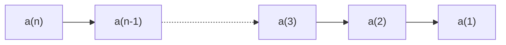
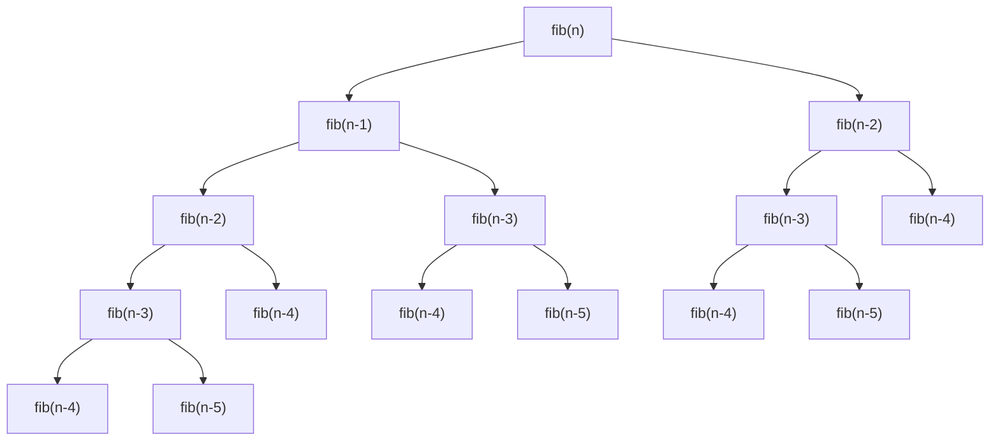

import ViewSource from "@site/src/components/ViewSource";
import Answer from "@site/src/components/Answer";

# 計算量

ここでは、計算量について学んでいきます。

## 計算量とは

計算量とは、アルゴリズムの実行に要する計算資源の量です。

計算量には、大きく時間計算量と空間計算量の２つがあります。

時間計算量は、アルゴリズムの実行に要するステップの数です。

空間計算量は、アルゴリズムの実行に要する記憶容量の数です。

## 計算量オーダー

ここで、計算量を比較することを考えてみましょう。

例えば、次の 2 つのプログラムを考えてみましょう。

<ViewSource path="/order/example1.ipynb" />

<ViewSource path="/order/example2.ipynb" />

$n = 2$ なら、2 番目のプログラムは、1 番目のプログラムの 2 倍の計算が必要です。
しかし、$n = 10000$ なら、2 番目のプログラムは、1 番目のプログラムの 10000 倍の計算が必要です。
$n = 2$ 程度なら計算量の差はほとんどありませんが、$n$ の値が大きくなると非常に大きな差が生まれてきます。

このように、アルゴリズムを比較するときには、入力サイズ $n$ が大きい時にどうなるのかを考えることが大切になります。
そのため、計算量を比較するときには、入力サイズ $n$ に対する関数を比較します。
1 番目のプログラムでは、$n$ 回、2 番目のプログラムでは、$n^2$ 回の計算が必要と考えます。

また、$n$ が十分大きいときには、$n$ と $n^2$ には大きな差が生じますが、$2n^2$ や $n^2 + n$ と $n^2$ の間にはほとんど違いがありません。このため、定数倍は無視し、最高次数以外の項も考えません。

## ランダウの記号

計算量を表すのには、ランダウの記号が便利です。

ランダウの記号は、$n$ が非常に大きい時の計算量を表します。
例えば、$n$ 回のステップが必要な時には、$O(n)$ と表します。

1. 最高次以外の項は、無視します。例: $n^2 + n + 1 = O(n^2)$
1. 係数は無視します。例: $3n^2 = O(n^2)$

## 各オーダーの比較

それぞれのオーダーを比較してみましょう。Python では、1 秒で $10^7$ 回ぐらいの計算ができます。$10^7$ 回を超えたところは、「-」で表します。

| データサイズ | $O(1)$ | $O(\log n)$ | $O(\sqrt{n})$ | $O(n)$   | $O(n\log n)$ | $O(n^2)$ | $O(n^3)$ | $O(2^n)$ | $O(n!)$ |
| ------------ | ------ | ----------- | ------------- | -------- | ------------ | -------- | -------- | -------- | ------- |
| 5            | 1      | 3           | 3             | 5        | 12           | 25       | 125      | 32       | 120     |
| 10           | 1      | 4           | 4             | 10       | 34           | 100      | 1000     | 1024     | 3628822 |
| 20           | 1      | 5           | 5             | 20       | 87           | 400      | 8000     | 1048576  | -       |
| 50           | 1      | 6           | 8             | 50       | 283          | 2500     | 125000   | -        | -       |
| 100          | 1      | 7           | 10            | 100      | 665          | 10000    | 1000000  | -        | -       |
| 1000         | 1      | 10          | 32            | 1000     | 9966         | 1000000  | -        | -        | -       |
| $10^4$       | 1      | 14          | 100           | 10000    | 132878       | -        | -        | -        | -       |
| $10^5$       | 1      | 17          | 317           | 100000   | 1660965      | -        | -        | -        | -       |
| $10^6$       | 1      | 20          | 1000          | 1000000  | -            | -        | -        | -        | -       |
| $10^7$       | 1      | 24          | 3163          | 10000000 | -            | -        | -        | -        | -       |
| $10^8$       | 1      | 27          | 10000         | -        | -            | -        | -        | -        | -       |
| $10^9$       | 1      | 30          | 31623         | -        | -            | -        | -        | -        | -       |
| $10^{10}$    | 1      | 34          | 100000        | -        | -            | -        | -        | -        | -       |

## 計算量の求め方

実際に、いくつかの計算量を求めてみましょう。

<ViewSource path="/order/example1.ipynb" />

このプログラムは for 文で $n$ 回繰り返されるので、計算量は $O(n)$ です。

<ViewSource path="/order/example2.ipynb" />

このプログラムは for 文で $n^2$ 回繰り返されるので、計算量は $O(n^2)$ です。

<ViewSource path="/order/example3.ipynb" />

このプログラムは一見すると $n$ 回の繰り返しに見えますが、`g` 関数の方にも繰り返しがあり、$n^2$ 回の繰り返しになるので、計算量は $O(n^2)$ です。

<ViewSource path="/order/example4.ipynb" />

このプログラムは for 文で $n^2+n=O(n^2)$ 回繰り返されるので、計算量は $O(n^2)$ です。

<ViewSource path="/recursion/recurrence_relation_rec.ipynb" />

再帰関数は少し難しいですがプログラムの流れを追っていくと次のようになっているので、$n$ 回処理が実行され、計算量は $O(n)$ です。

<ViewSource path="/recursion/fib.ipynb" />

これは、難しいです。図を書くとわかりやすいです。計算量は、この図のノードの数になります。それぞれのノードから、二本の矢印が出ていて、最大 $n$ 回で `fib(0)` まで到達するので、計算量は $O(2^n)$ よりも小さくなります。

一応、数学的にも、計算しておきます。

計算量を $T(n)$ とします。

$$
\begin{aligned}
    T(n) &= T(n-1) + T(n-2) \\
         &<2T(n-1) \quad (\because T(n-2)<T(n-1)) \\
         &<2^2T(n-2) \\
         &<\cdots \\
         &<2^nT(0) \\
         &=2^n \\
\end{aligned}
$$

これで、計算量が $O(2^n)$ よりも小さいことが証明できました。

:::note

ちなみに、次のようにすると計算量が $\left(\sqrt{2}\right)^n$ よりも大きいことが証明できます。

$$
\begin{aligned}
    T(n) &= T(n-1) + T(n-2) \\
         &>2T(n-2) \quad (\because T(n-1)>T(n-2)) \\
         &>2^2T(n-4) \\
         &>\cdots \\
         &>2^{\frac{n}{2}}T(0) \\
         &=2^{\frac{n}{2}} = \left(\sqrt{2}\right)^n \\
\end{aligned}
$$

:::

:::note

計算量は $O(2^n)$ よりも小さくなると言いましたが、実際に厳密に計算すると $O\left(\left(\frac{1+\sqrt{5}}{2}\right)^n\right)$ になります。($\frac{1+\sqrt{5}}{2}\simeq 1.618$)

ランダウの記号は、$n$ が十分大きい時、ある関数以下に抑えられるという意味なので、$O(2^n)$ と言っても間違いではないとは思います。

これは、漸化式を解けば求まります。この漸化式は、フィボナッチ数列と同じです。

$$
\begin{aligned}
    T(n) &= T(n-1) + T(n-2) \\
    &\cdots \\
    \therefore T(n) &= \frac{1}{\sqrt{5}}\left\{\left(\frac{1 + \sqrt{5}}{2}\right)^n - \left(\frac{1 - \sqrt{5}}{2}\right)^n\right\} \\
                    &= O\left(\left(\frac{1+\sqrt{5}}{2}\right)^n\right)
\end{aligned}
$$

:::

## 練習問題 1

次のプログラムの計算量を求めてください。

<ViewSource path="/order/exercise1.ipynb" />

<Answer>

for 文の中が `n` 回繰り返されるので、$O(n)$ となります。

</Answer>

## 練習問題 2

次のプログラムの計算量を求めてください。

<ViewSource path="/order/exercise2.ipynb" />

<Answer>

こちらも for 文の中がデータ数を $n$ とすると、 $n$ 回繰り返されるので、$O(n)$となります。

</Answer>

## 練習問題 3

次のプログラムの計算量を求めてください。

<ViewSource path="/order/exercise3.ipynb" />

<Answer>

処理自体は一回しか行われないので、$O(1)$となります。

</Answer>
